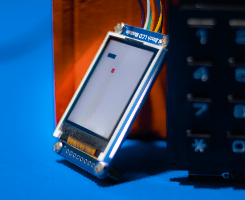
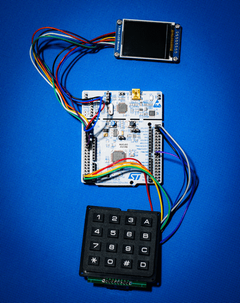

# Snake clone on STM32 microcontroller

This project was an assignment for an elective subject - "microcontrollers". We had to develop something for an STM32 microcontroller which used at least two hardware interrupts. Therefore I grabbed an LCD screen, keypad, bunch of wires and coded good ol' snake from scratch.

|   |   |
|:---:|:---:|
| LCD screen | Whole setup |
## Hardware interrupts

System uses two types of interrupts. One of them is triggered by the keypad attached to external pins (EXTI). When the state of some of those pins changes, interrupt is triggered and proper function is called to handle it. Together with an internal timer it allows to detect which button was pressed.  

The second type is triggered by the timer itself (TIM). This piece of hardware is extremely useful not only for accurate time measurements but also for the game loop. Basically, it allows calling specific function every fixed chunk of time, ``update()`` for example, called every "frame".

## Game mechanics

Implementing *gameplay* mechanics was probably the easiest and most pleasent part of the project. I thought about this game because in my early years of learning coding I somehow missed an opportunity to write a simple snake.

Screen (130x160) is divided into square fields of side 8px long. Therefore a snake is basically a sequence of fields on a grid. I wanted to avoid storing that sequence in a linked list or something so I came up with a neat solution. Our snake has to move throughout the game but at each step only a small fraction of it really moves - head and tail, other pieces do not change. Having a pointer to the head and tail, all we have to do every frame is find new ones. Finding a new head is easy if we only store the current direction of our reptile. With a tail it's not obvious as the snake can be closely and more than one neighbouring tile belongs to its body. That's why I order fields with consecutive numbers according to placement, head always has the biggest, tail the lowest.

Finding a new target is just picking a random tile if only it is not already occupied by the snake (matter of checking one value in 2D array). 

## Low-level programming experience

That was my first and only encounter with such a low-level programming so far and I definitely do not regret it. It allowed me to really feel the interaction with the hardware and shed some light on what is going on there. My takeaway is also the courage to dig down into the messy and complicated technical documentation of microcontrollers. With this in mind, learning new frameworks feels like a walk in the park.
